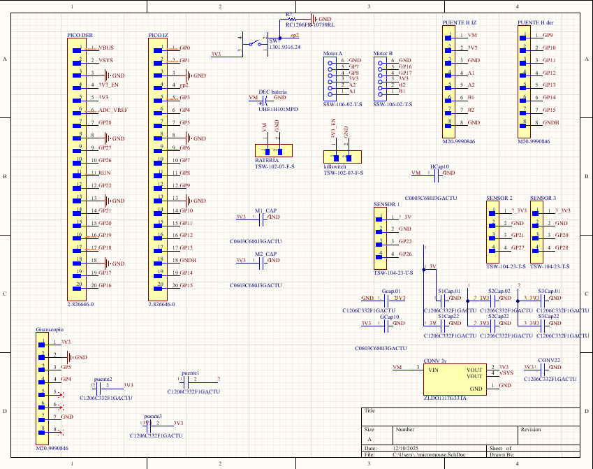
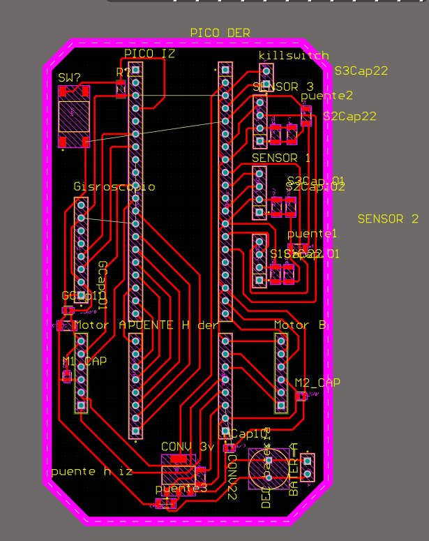
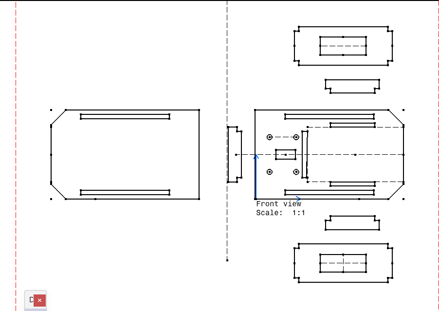
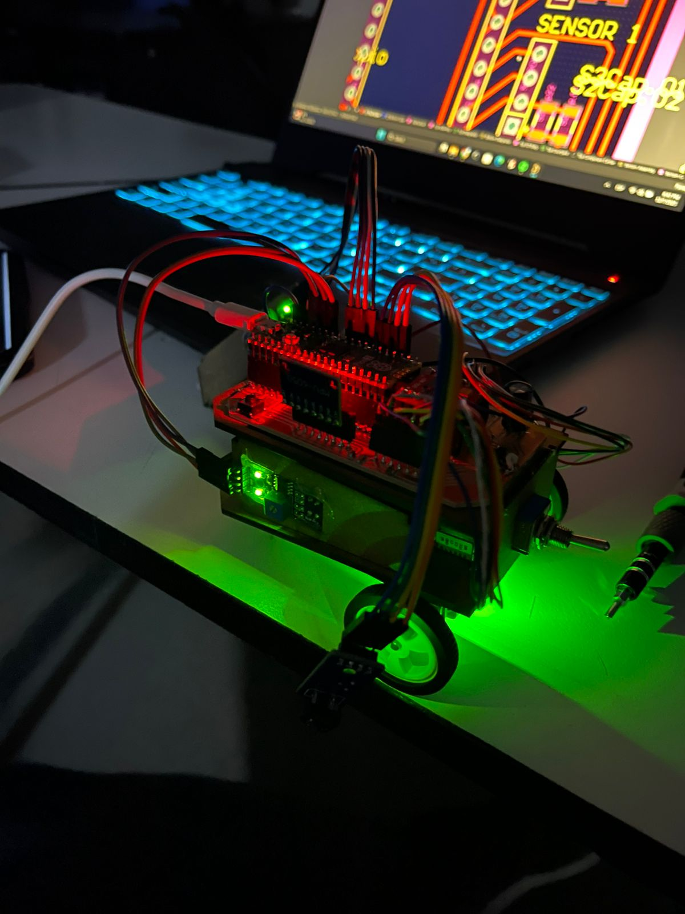

#  Proyecto Final micromouse

##  Resumen

- *Nombre del proyecto:* Capstone Micromouse
- *Equipo / Autor(es):* Juan David García Cortez y Sumie Arai Erazo  
- *Curso / Asignatura:* Sistemas embebidos 1  
- *Fecha:* 10/12/25 

##  Objetivos

- El proyecto Micromouse consiste en diseñar y programar un robot móvil autónomo capaz de explorar un laberinto, construir un mapa y ejecutar una carrera rápida (fast run) desde el inicio hasta el objetivo en el centro.

##  Arquitectura
### Esquemático



### Diseño de la PCB


### Diseño del mecanismo




## Materiales

- MDF
- Puente H, TB6612NF
- Rapberry Pi Pico
- Capacitores de 0.1, 10, 20, 100 microfaradios
- Transformador de voltaje a 3.3V
- Sensor TRT500
- Giroscopio MPU-6050
- Pila de 7.4 V y 0.2 A
- Motores pololu de 300 rev con encoder M20 y 949
- Switch
- Rueda Loca
- Llantas de 4 cm de diámetro  

##  Código del Proyecto
```bash
#include <stdio.h>
#include <stdlib.h>
#include <math.h>
#include <stdint.h>
#include "pico/stdlib.h"
#include "hardware/pwm.h"
#include "hardware/gpio.h"
#include "hardware/irq.h"
#include "hardware/adc.h"
#include "hardware/i2c.h"
#include "hardware/timer.h"
#include "pico/time.h"

// ==========================================
// 1. PINES
// ==========================================
#define LED_PIN 25
#define I2C_PORT i2c0
#define I2C_SDA 4
#define I2C_SCL 5
#define MPU6050_ADDR 0x68

#define PWMA 9      
#define AI1 10
#define AI2 11
#define PWMB 15     
#define BI1 14
#define BI2 13
#define STBY 12

#define ADC_CH_LEFT 0
#define ADC_CH_FRONT 1
#define ADC_CH_RIGHT 2

#define ENC_A_PIN 8  
#define ENC_B_PIN 16 

// ==========================================
// 2. CONSTANTES CALIBRADAS (ACTUALIZADAS)
// ==========================================

// Giroscopio escala
const float GYRO_SCALE = 30.0f;
const long TICKS_POR_CELDA = 1270;

// VELOCIDAD
const int BASE_SPEED = 200;       
const int TURN_SPEED = 250;
const int REV_SPEED = 120; 

// ZONAS MUERTAS (Fricción mínima)
const int DEADZONE_A = 170; // Izquierdo
const int DEADZONE_B = 150; // Derecho

// UMBRALES DE PARED 
const uint16_t UMBRAL_FRONTAL = 2000;
const uint16_t UMBRAL_L_EXISTE = 1500;  
const uint16_t UMBRAL_R_EXISTE = 3500;  

//  PID PARED (AVANCE) - Usa tus valores calibrados
float Kp_Wall = 0.35f; 
float Kd_Wall = 4.0f; 
float prev_error_wall = 0;

//  NUEVAS CONSTANTES: PID DE ANGULO (RECTITUD)
float Kp_Angle = 1.8f;// Proporcional: Fuerza para corregir el ángulo
float Kd_Angle = 0.05f; // Derivativo: Amortigua la corrección (evita oscilación rápida)
float target_angle_move = 0.0f; // El ángulo al que debe apuntar el robot (se inicializa en avanzar_una_celda)
float prev_error_angle = 0.0f;

// --- PID REVERSA (NUEVO: PID COMPLETO) ---
// Ajusta estos valores si vibra o no corrige suficiente
float Kp_Rev = 12.0f;  // Fuerza de corrección principal
float Kd_Rev = 0.8f;   // Amortiguación (evita oscilación)
float Ki_Rev = 0.02f;  // Corrección de error acumulado

// Variables globales PID Reversa
float prev_error_rev = 0;
float integral_rev = 0;

int16_t gyro_offset_raw = 0;
float current_global_angle = 0.0f; // Angulo acumulado
uint16_t target_L = 220;
uint16_t target_R = 2629;       

absolute_time_t time_to_enable_pid;
volatile long countA = 0;

// ==========================================
// 3. MATRICES Y LOGICA
// ==========================================
#define MAZE_SIZE 12

int orientacion_actual = 0; // 0=N, 1=E, 2=S, 3=W
int pos_x = 0;
int pos_y = 0;

uint8_t visited[MAZE_SIZE][MAZE_SIZE];
uint8_t walls[MAZE_SIZE][MAZE_SIZE];

// ==========================================
// 4. HARDWARE
// ==========================================
void gpio_callback(uint gpio, uint32_t events) { if (gpio == ENC_A_PIN) countA++; }

void mpu6050_init_standard() {
    uint8_t buf[] = {0x6B, 0x00}; i2c_write_blocking(I2C_PORT, MPU6050_ADDR, buf, 2, false); sleep_ms(100);
    uint8_t conf[] = {0x1B, 0x00}; i2c_write_blocking(I2C_PORT, MPU6050_ADDR, conf, 2, false); sleep_ms(10);
}

int16_t read_gyro_z() {
    uint8_t buffer[2]; uint8_t reg = 0x47;
    i2c_write_blocking(I2C_PORT, MPU6050_ADDR, &reg, 1, true);
    i2c_read_blocking(I2C_PORT, MPU6050_ADDR, buffer, 2, false);
    return (int16_t)(buffer[0] << 8 | buffer[1]);
}

void update_angle_global() {
    static absolute_time_t t_prev_g = {0};
    if (to_us_since_boot(t_prev_g) == 0) t_prev_g = get_absolute_time();
    
    absolute_time_t t_now = get_absolute_time();
    int64_t dt_us = absolute_time_diff_us(t_prev_g, t_now);
    t_prev_g = t_now;
    
    float dt = dt_us / 1000000.0f;
    int16_t raw = read_gyro_z();
    
    if (abs(raw - gyro_offset_raw) < 20) return;
    
    float dps = (raw - gyro_offset_raw) / GYRO_SCALE;
    current_global_angle += dps * dt;
}

void setMotor(int motor, int pwm_val) {
    int pinPWM = (motor == 0) ? PWMA : PWMB;
    int pin1 = (motor == 0) ? AI1 : BI1; int pin2 = (motor == 0) ? AI2 : BI2;
    int deadzone = (motor == 0) ? DEADZONE_A : DEADZONE_B;

    int pwm_final = 0;
    if (pwm_val > 0) pwm_final = pwm_val + deadzone;
    else if (pwm_val < 0) pwm_final = pwm_val - deadzone;
    
    if (pwm_final > 950) pwm_final = 950;  
    if (pwm_final < -950) pwm_final = -950;

    if (pwm_final >= 0) { gpio_put(pin1, 0); gpio_put(pin2, 1); pwm_set_gpio_level(pinPWM, pwm_final); }
    else { gpio_put(pin1, 1); gpio_put(pin2, 0); pwm_set_gpio_level(pinPWM, abs(pwm_final)); }
}

void init_all() {
    stdio_init_all();
    i2c_init(I2C_PORT, 400 * 1000);
    gpio_set_function(I2C_SDA, GPIO_FUNC_I2C); gpio_pull_up(I2C_SDA);
    gpio_set_function(I2C_SCL, GPIO_FUNC_I2C); gpio_pull_up(I2C_SCL);
    mpu6050_init_standard();
    
    gpio_init(LED_PIN); gpio_set_dir(LED_PIN, GPIO_OUT);
    
    int pins_out[] = {AI1, AI2, BI1, BI2, STBY};
    for(int i=0; i<5; i++) { gpio_init(pins_out[i]); gpio_set_dir(pins_out[i], GPIO_OUT); }
    gpio_put(STBY, 1);
    
    gpio_set_function(PWMA, GPIO_FUNC_PWM); gpio_set_function(PWMB, GPIO_FUNC_PWM);
    pwm_set_wrap(pwm_gpio_to_slice_num(PWMA), 1000); pwm_set_enabled(pwm_gpio_to_slice_num(PWMA), true);
    pwm_set_wrap(pwm_gpio_to_slice_num(PWMB), 1000); pwm_set_enabled(pwm_gpio_to_slice_num(PWMB), true);
    
    adc_init(); adc_gpio_init(26); adc_gpio_init(27); adc_gpio_init(28);
    gpio_init(ENC_A_PIN); gpio_set_dir(ENC_A_PIN, GPIO_IN); gpio_pull_up(ENC_A_PIN);
    gpio_set_irq_enabled_with_callback(ENC_A_PIN, GPIO_IRQ_EDGE_RISE | GPIO_IRQ_EDGE_FALL, true, &gpio_callback);
    
    time_to_enable_pid = get_absolute_time();
}

// ==========================================
// 5. MOVIMIENTOS
// ==========================================

void girar_grados(float grados_objetivo) {
    setMotor(0,0); setMotor(1,0); sleep_ms(200);

    float start_angle = current_global_angle;
    float target_angle = start_angle + grados_objetivo;
    
    while (true) {
        update_angle_global();
        float error = target_angle - current_global_angle;
        
        if (fabs(error) < 1.0) break; 

        int speed = TURN_SPEED;
        if (fabs(error) < 15.0) speed = 180; 

        if (error > 0) { 
             setMotor(0, -speed); setMotor(1, speed);
        } else { 
             setMotor(0, speed); setMotor(1, -speed);
        }
    }

    setMotor(0, 0); setMotor(1, 0);
    current_global_angle = round(current_global_angle / 90.0f) * 90.0f;
    time_to_enable_pid = delayed_by_ms(get_absolute_time(), 300);
    prev_error_wall = 0; sleep_ms(200);
}

// ==========================================
// 6. LOGICA
// ==========================================

void decidir_y_mover() {
          // 1. DETERMINAR DIRECCIONES Y COORDENADAS FUTURAS
          int dir_frente = orientacion_actual;
          int dir_der = (orientacion_actual + 1) % 4;
          int dir_izq = (orientacion_actual + 3) % 4;
          
          int dx[] = {0, 1, 0, -1};
          int dy[] = {1, 0, -1, 0};
          
          int next_x_F = pos_x + dx[dir_frente];
          int next_y_F = pos_y + dy[dir_frente];
          int next_x_R = pos_x + dx[dir_der];
          int next_y_R = pos_y + dy[dir_der];
          int next_x_L = pos_x + dx[dir_izq];
          int next_y_L = pos_y + dy[dir_izq];
          
          // 2. LECTURA DE PAREDES (HUECOS)
          adc_select_input(ADC_CH_FRONT); bool pared_F = (adc_read() < UMBRAL_FRONTAL);
          adc_select_input(ADC_CH_LEFT);     bool pared_L = (adc_read() < UMBRAL_L_EXISTE);     
          adc_select_input(ADC_CH_RIGHT); bool pared_R = (adc_read() < UMBRAL_R_EXISTE);
          
          bool hueco_L = !pared_L;
          bool hueco_R = !pared_R;
          bool hueco_F = !pared_F; 
          
          // 3. ACTUALIZAR MAPA Y LOGS
          senalizar_paredes(pared_L, pared_F, pared_R);
          update_walls_real(pared_L, pared_F, pared_R);
          printf("Pos(%d,%d) Ori:%d | L:%d F:%d R:%d\n", pos_x, pos_y, orientacion_actual, pared_L, pared_F, pared_R);

          bool move_done = false;
    bool avanzar_done = false; // Indica si avanzó una celda completa
          
          // Detección de celdas NUEVAS válidas
          bool nuevo_R = hueco_R && es_valida(next_x_R, next_y_R) && visited[next_x_R][next_y_R] == 0;
          bool nuevo_F = hueco_F && es_valida(next_x_F, next_y_F) && visited[next_x_F][next_y_F] == 0;
          bool nuevo_L = hueco_L && es_valida(next_x_L, next_y_L) && visited[next_x_L][next_y_L] == 0;
          
          // ======================================================
          // === PRIORIDAD 1: NUEVAS CELDAS (Derecha -> Frente -> Izquierda) ===
          // ======================================================
          if (nuevo_R) {
                    printf("Decisión: Nuevo a la derecha\n");
                    girar_grados(-90); 
                    orientacion_actual = dir_der;
                    avanzar_done = avanzar_una_celda();
                    move_done = true;
          }
          else if (nuevo_F) {
                    printf("Decisión: Nuevo al frente\n");
                    avanzar_done = avanzar_una_celda();
                    move_done = true;
          }
          else if (nuevo_L) {
                    printf("Decisión: Nuevo a la izquierda\n");
                    girar_grados(90); 
                    orientacion_actual = dir_izq;
                    avanzar_done = avanzar_una_celda();
                    move_done = true;
          }

    // 🔥 Si el avance fue interrumpido, el robot sigue en la misma celda. Forzar reevaluación.
    if (move_done && !avanzar_done) { 
        printf("ADVERTENCIA: Avance frontal bloqueado. Reevaluando...\n");
        // Reiniciamos move_done para pasar a la Prioridad 2/3.
        move_done = false; 
    }
    
          // Si la celda fue completada con éxito, actualizamos coordenadas.
    if (move_done && avanzar_done) {
        pos_x = pos_x + dx[orientacion_actual]; 
        pos_y = pos_y + dy[orientacion_actual];
    }
    
          // ======================================================
          // === PRIORIDAD 2: CELDAS VISITADAS (Frente -> Derecha -> Izquierda) ===
          // ======================================================
          if (!move_done) {
                    
                    // Celdas Viejas Válidas que SÍ fueron visitadas antes
                    bool viejo_F = hueco_F && es_valida(next_x_F, next_y_F) && visited[next_x_F][next_y_F] == 1;
                    bool viejo_R = hueco_R && es_valida(next_x_R, next_y_R) && visited[next_x_R][next_y_R] == 1;
                    bool viejo_L = hueco_L && es_valida(next_x_L, next_y_L) && visited[next_x_L][next_y_L] == 1;

                    // Se prioriza el Frente para no girar innecesariamente
                    if (viejo_F) {
                              printf("Decisión: Frente visitado\n");
                    }
                    else if (viejo_R) {
                              printf("Decisión: Derecha visitada\n");
                              girar_grados(-90); 
                              orientacion_actual = dir_der;
                    }
                    else if (viejo_L) {
                              printf("Decisión: Izquierda visitada\n");
                              girar_grados(90); 
                              orientacion_actual = dir_izq;
                    }

                    // Si se tomó una decisión de movimiento, ejecutar avance
                    if (viejo_F || viejo_R || viejo_L) {
                              avanzar_done = avanzar_una_celda();
                              move_done = true;

            if (avanzar_done) {
                pos_x = pos_x + dx[orientacion_actual]; 
                pos_y = pos_y + dy[orientacion_actual];
            } else {
                // Si choca aquí, forzamos la reevaluación al Dead End
                move_done = false;
            }
                    }
          }
          
          // ======================================================
          // === PRIORIDAD 3: CALLEJÓN SIN SALIDA (Reversa) ===
          // ======================================================
    // Solo se ejecuta si move_done es FALSE (no hay huecos disponibles O se interrumpió por choque frontal)
          if (!move_done) {
                    printf(">> DEAD END -> REVERSA PID\n");
                    retroceder_una_celda_pid();
                    
                    // Retroceder en las coordenadas
                    if (orientacion_actual == 0) pos_y--;
                    else if (orientacion_actual == 1) pos_x--;
                    else if (orientacion_actual == 2) pos_y++;
                    else if (orientacion_actual == 3) pos_x++;
          }
}

// === NUEVO: REVERSA PID COMPLETO (P + I + D) ===
void retroceder_una_celda_pid() {
    printf(">> REVERSA PID FULL (DEAD END)...\n");
    countA = 0; 
    
    // Resetear variables PID
    prev_error_rev = 0;
    integral_rev = 0;
    
    // Fijar el angulo objetivo como el actual (mantener rectitud)
    float target_angle_rev = current_global_angle;
    
    // Para calculo de derivada (dt)
    absolute_time_t t_prev_pid = get_absolute_time();

    while (countA < TICKS_POR_CELDA) {
        update_angle_global();
        
        // Calculo dt
        absolute_time_t t_now = get_absolute_time();
        int64_t dt_us = absolute_time_diff_us(t_prev_pid, t_now);
        
        // Evitar division por cero o dt muy pequeño
        if (dt_us < 1000) { sleep_us(100); continue; }
        t_prev_pid = t_now;
        float dt = dt_us / 1000000.0f; // Segundos

        // Error: Diferencia entre angulo deseado y actual
        float error = target_angle_rev - current_global_angle;
        
        // Proporcional
        float P = error * Kp_Rev;
        
        // Integral (con anti-windup)
        integral_rev += (error * dt);
        if (integral_rev > 10.0f) integral_rev = 10.0f;
        if (integral_rev < -10.0f) integral_rev = -10.0f;
        float I = integral_rev * Ki_Rev;
        
        // Derivativo
        float D = ((error - prev_error_rev) / dt) * Kd_Rev;
        prev_error_rev = error;
        
        // Salida PID
        float output = P + I + D;
        
        // Limitar correccion
        int correction = (int)output;
        if (correction > 150) correction = 150;
        if (correction < -150) correction = -150;

        // Aplicar correccion a motores en reversa
        // Si error > 0 (robot mira izq), correccion positiva.
        // Queremos enderezar a derecha. Motor DER debe frenar menos (ir mas rapido atras).
        setMotor(0, -REV_SPEED - correction); 
        setMotor(1, -REV_SPEED + correction);
        
        sleep_ms(1);
    }
    setMotor(0, 0); setMotor(1, 0); sleep_ms(300);
}

// ==========================================
// 6. LOGICA
// ==========================================

void init_maps() {
    for(int i=0; i<MAZE_SIZE; i++) {
        for(int j=0; j<MAZE_SIZE; j++) { walls[i][j] = 0; visited[i][j] = 0; }
    }
}

bool es_valida(int x, int y) {
    return (x >= 0 && x < MAZE_SIZE && y >= 0 && y < MAZE_SIZE);
}

void update_walls_real(bool L, bool F, bool R) {
    int abs_frente = orientacion_actual;
    int abs_der = (orientacion_actual + 1) % 4;
    int abs_izq = (orientacion_actual + 3) % 4;
    
    int mask = 0;
    if (F) mask |= (1 << abs_frente);
    if (R) mask |= (1 << abs_der);
    if (L) mask |= (1 << abs_izq);
    
    walls[pos_x][pos_y] |= mask;
    visited[pos_x][pos_y] = 1;
    
    if (mask & 1 && pos_y < MAZE_SIZE - 1) walls[pos_x][pos_y+1] |= 4;
    if (mask & 2 && pos_x < MAZE_SIZE - 1) walls[pos_x+1][pos_y] |= 8;
    if (mask & 4 && pos_y > 0)             walls[pos_x][pos_y-1] |= 1;
    if (mask & 8 && pos_x > 0)             walls[pos_x-1][pos_y] |= 2;
}

void senalizar_paredes(bool L, bool F, bool R) {
    if (F) { gpio_put(LED_PIN, 1); sleep_ms(50); gpio_put(LED_PIN, 0); sleep_ms(100); }
    if (L) { gpio_put(LED_PIN, 1); sleep_ms(1000); gpio_put(LED_PIN, 0); sleep_ms(100); }
    if (R) { gpio_put(LED_PIN, 1); sleep_ms(2000); gpio_put(LED_PIN, 0); sleep_ms(100); }
}

// ==========================================
// 6. LOGICA (decidir_y_mover MODIFICADA)
// ==========================================

// [MODIFICADO] La llamada a avanzar_una_celda() ahora se hace con 'avanzar_done = avanzar_una_celda();'

// ==========================================
// 6. LOGICA
// ==========================================

void decidir_y_mover() {
    // 1. DETERMINAR DIRECCIONES Y COORDENADAS FUTURAS
    int dir_frente = orientacion_actual;
    int dir_der = (orientacion_actual + 1) % 4;
    int dir_izq = (orientacion_actual + 3) % 4;
    
    int dx[] = {0, 1, 0, -1};
    int dy[] = {1, 0, -1, 0};
    
    int next_x_F = pos_x + dx[dir_frente];
    int next_y_F = pos_y + dy[dir_frente];
    int next_x_R = pos_x + dx[dir_der];
    int next_y_R = pos_y + dy[dir_der];
    int next_x_L = pos_x + dx[dir_izq];
    int next_y_L = pos_y + dy[dir_izq];
    
    // 2. LECTURA DE PAREDES (HUECOS)
    adc_select_input(ADC_CH_FRONT); bool pared_F = (adc_read() < UMBRAL_FRONTAL);
    adc_select_input(ADC_CH_LEFT);  bool pared_L = (adc_read() < UMBRAL_L_EXISTE);  
    adc_select_input(ADC_CH_RIGHT); bool pared_R = (adc_read() < UMBRAL_R_EXISTE);
    
    bool hueco_L = !pared_L;
    bool hueco_R = !pared_R;
    bool hueco_F = !pared_F; 
    
    // 3. ACTUALIZAR MAPA Y LOGS
    senalizar_paredes(pared_L, pared_F, pared_R);
    update_walls_real(pared_L, pared_F, pared_R);
    printf("Pos(%d,%d) Ori:%d | L:%d F:%d R:%d\n", pos_x, pos_y, orientacion_actual, pared_L, pared_F, pared_R);

    bool move_done = false;
    bool avanzar_done = false; // Indica si avanzó una celda completa
    
    // Detección de celdas NUEVAS válidas
    bool nuevo_R = hueco_R && es_valida(next_x_R, next_y_R) && visited[next_x_R][next_y_R] == 0;
    bool nuevo_F = hueco_F && es_valida(next_x_F, next_y_F) && visited[next_x_F][next_y_F] == 0;
    bool nuevo_L = hueco_L && es_valida(next_x_L, next_y_L) && visited[next_x_L][next_y_L] == 0;
    
    // ======================================================
    // === PRIORIDAD 1: NUEVAS CELDAS (Derecha -> Frente -> Izquierda) ===
    // ======================================================
    if (nuevo_R) {
        printf("Decisión: Nuevo a la derecha\n");
        girar_grados(-90); 
        orientacion_actual = dir_der;
        avanzar_done = avanzar_una_celda();
        move_done = true;
    }
    else if (nuevo_F) {
        printf("Decisión: Nuevo al frente\n");
        avanzar_done = avanzar_una_celda();
        move_done = true;
    }
    else if (nuevo_L) {
        printf("Decisión: Nuevo a la izquierda\n");
        girar_grados(90); 
        orientacion_actual = dir_izq;
        avanzar_done = avanzar_una_celda();
        move_done = true;
    }

    // 🔥 Si el avance fue interrumpido, el robot sigue en la misma celda. Forzar reevaluación.
    if (move_done && !avanzar_done) { 
        printf("ADVERTENCIA: Avance frontal bloqueado. Reevaluando...\n");
        // Reiniciamos move_done para pasar a la Prioridad 2/3.
        move_done = false; 
    }
    
    // Si la celda fue completada con éxito, actualizamos coordenadas.
    if (move_done && avanzar_done) {
        pos_x = pos_x + dx[orientacion_actual]; 
        pos_y = pos_y + dy[orientacion_actual];
    }
    
    // ======================================================
    // === PRIORIDAD 2: CELDAS VISITADAS (Frente -> Derecha -> Izquierda) ===
    // ======================================================
    if (!move_done) {
        
        // Celdas Viejas Válidas que SÍ fueron visitadas antes
        bool viejo_F = hueco_F && es_valida(next_x_F, next_y_F) && visited[next_x_F][next_y_F] == 1;
        bool viejo_R = hueco_R && es_valida(next_x_R, next_y_R) && visited[next_x_R][next_y_R] == 1;
        bool viejo_L = hueco_L && es_valida(next_x_L, next_y_L) && visited[next_x_L][next_y_L] == 1;

        // Se prioriza el Frente para no girar innecesariamente
        if (viejo_F) {
            printf("Decisión: Frente visitado\n");
        }
        else if (viejo_R) {
            printf("Decisión: Derecha visitada\n");
            girar_grados(-90); 
            orientacion_actual = dir_der;
        }
        else if (viejo_L) {
            printf("Decisión: Izquierda visitada\n");
            girar_grados(90); 
            orientacion_actual = dir_izq;
        }

        // Si se tomó una decisión de movimiento, ejecutar avance
        if (viejo_F || viejo_R || viejo_L) {
            avanzar_done = avanzar_una_celda();
            move_done = true;

            if (avanzar_done) {
                pos_x = pos_x + dx[orientacion_actual]; 
                pos_y = pos_y + dy[orientacion_actual];
            } else {
                // Si choca aquí, forzamos la reevaluación al Dead End
                move_done = false;
            }
        }
    }
    
    // ======================================================
    // === PRIORIDAD 3: CALLEJÓN SIN SALIDA (Reversa) ===
    // ======================================================
    // Solo se ejecuta si move_done es FALSE (no hay huecos disponibles O se interrumpió por choque frontal)
    if (!move_done) {
        printf(">> DEAD END -> REVERSA PID\n");
        retroceder_una_celda_pid();
        
        // Retroceder en las coordenadas
        if (orientacion_actual == 0) pos_y--;
        else if (orientacion_actual == 1) pos_x--;
        else if (orientacion_actual == 2) pos_y++;
        else if (orientacion_actual == 3) pos_x++;
    }
}
// ==========================================
// 7. MAIN
// ==========================================
int main() {
    init_all();
    sleep_ms(1000);
    
    // Calibrar Gyro
    long sum = 0; for(int i=0; i<300; i++) { sum += read_gyro_z(); sleep_ms(2); }  
    gyro_offset_raw = sum / 300;
    
    for(int i=0; i<5; i++) { gpio_put(LED_PIN, 1); sleep_ms(100); gpio_put(LED_PIN, 0); sleep_ms(100); }
    
    init_maps();
    
    printf(">> START MICROMOUSE (PID REVERSA)!\n");
    
    avanzar_una_celda();
    pos_x = 0; pos_y = 1; orientacion_actual = 0;
    visited[0][0] = 1; visited[0][1] = 1;
    
    while (true) {
        update_angle_global();
        
        if ((pos_x==5 || pos_x==6) && (pos_y==5 || pos_y==6)) {
            printf("\n>> META ALCANZADA! <<\n");
            setMotor(0,0); setMotor(1,0);
            while(1) { gpio_put(LED_PIN, 1); sleep_ms(200); gpio_put(LED_PIN, 0); sleep_ms(200); }
        }
        decidir_y_mover();
        sleep_ms(200); 
    }
}
```
### Pruebas 
- Con ayuda del multímetro verificamos que la energía fluyera de manera propia, es decir, que salieran 7.4V y 3.3V en dónde lo requiriera.

Co n el siguiente código encontramos: kp, kd, umbrales laterales y frontales: 
```bash
#include <stdio.h>
#include <stdlib.h>
#include <math.h>
#include <stdint.h>
#include "pico/stdlib.h"
#include "hardware/pwm.h"
#include "hardware/gpio.h"
#include "hardware/adc.h"
#include "hardware/i2c.h" 
#include "hardware/irq.h" 

// ==========================================
// 1. PINES (CONFIGURACIÓN DE TU ROBOT)
// ==========================================
#define LED_PIN 25
#define I2C_PORT i2c0
#define I2C_SDA 4
#define I2C_SCL 5
#define MPU6050_ADDR 0x68

#define PWMA 9      
#define AI1 10
#define AI2 11
#define PWMB 15    
#define BI1 14
#define BI2 13
#define STBY 12

#define ADC_CH_LEFT 0  // GPIO 26
#define ADC_CH_FRONT 1 // GPIO 27
#define ADC_CH_RIGHT 2 // GPIO 28

#define ENC_A_PIN 8  
#define ENC_B_PIN 16 

// ==========================================
// 2. CONSTANTES CALIBRABLES (¡ACTUALIZA AQUÍ!)
// ==========================================

const int BASE_SPEED = 100;

const int DEADZONE_A = 170; // Motor Izquierdo (A)
const int DEADZONE_B = 150; // Motor Derecho (B)

uint16_t target_L = 220;      
uint16_t target_R = 2629;     

const uint16_t UMBRAL_L_EXISTE = 1500; 
const uint16_t UMBRAL_R_EXISTE = 3500; 
const uint16_t UMBRAL_FRONTAL = 1200; 

float Kp_Wall = 0.2f;  
float Kd_Wall = 0.0f;  
float prev_error_wall = 0;


// ==========================================
// 3. FUNCIONES DE HARDWARE ESENCIALES
// ==========================================

void setMotor(int motor, int pwm_val) {
    int pinPWM = (motor == 0) ? PWMA : PWMB;
    int pin1 = (motor == 0) ? AI1 : BI1; 
    int pin2 = (motor == 0) ? AI2 : BI2;
    int deadzone = (motor == 0) ? DEADZONE_A : DEADZONE_B;

    int pwm_final = 0;
    if (pwm_val > 0) pwm_final = pwm_val + deadzone;
    else if (pwm_val < 0) pwm_final = pwm_val - deadzone;
    
    if (pwm_final > 950) pwm_final = 950; 
    if (pwm_final < -950) pwm_final = -950;

    if (pwm_final >= 0) { 
        gpio_put(pin1, 0); 
        gpio_put(pin2, 1); 
        pwm_set_gpio_level(pinPWM, pwm_final); 
    } else { 
        gpio_put(pin1, 1); 
        gpio_put(pin2, 0); 
        pwm_set_gpio_level(pinPWM, abs(pwm_final)); 
    }
}

uint16_t read_adc(int channel) {
    adc_select_input(channel);
    return adc_read();
}

void flash_led(int veces, int tiempo_ms) {
    for(int i=0; i<veces; i++) {
        gpio_put(LED_PIN, 1); sleep_ms(tiempo_ms); 
        gpio_put(LED_PIN, 0); sleep_ms(tiempo_ms); 
    }
}

// 🔥 NUEVA FUNCIÓN: ESPERAR HASTA QUE SE PRESIONE UNA TECLA
void wait_for_key() {
    printf("\n>>> PRESIONA CUALQUIER TECLA (y Enter) PARA CONTINUAR <<<\n");
    // Esperar a que se presione la primera tecla
    while(getchar() == EOF);
    
    // Limpiar el buffer (incluyendo Enter) para la próxima lectura
    int c; while ((c = getchar()) != '\n' && c != '\r' && c != EOF);
}

void init_all_calib() {
    // 1. Inicialización Serial y espera 
    stdio_init_all();
    sleep_ms(3000); 

    // 2. LED y STBY (H-Bridge Enable)
    gpio_init(LED_PIN); gpio_set_dir(LED_PIN, GPIO_OUT);
    
    int pins_out[] = {AI1, AI2, BI1, BI2, STBY};
    for(int i=0; i<5; i++) { gpio_init(pins_out[i]); gpio_set_dir(pins_out[i], GPIO_OUT); }
    gpio_put(STBY, 1); 
    
    // 3. Configuración PWM
    gpio_set_function(PWMA, GPIO_FUNC_PWM); gpio_set_function(PWMB, GPIO_FUNC_PWM);
    uint slice_A = pwm_gpio_to_slice_num(PWMA);
    uint slice_B = pwm_gpio_to_slice_num(PWMB);
    
    pwm_set_wrap(slice_A, 1000); pwm_set_enabled(slice_A, true);
    pwm_set_wrap(slice_B, 1000); pwm_set_enabled(slice_B, true);
    
    // 4. Inicialización ADC
    adc_init(); 
    adc_gpio_init(26); 
    adc_gpio_init(27); 
    adc_gpio_init(28); 
}

// ==========================================
// 4. SECUENCIAS DE CALIBRACION
// ==========================================

void calibracion_sensores() {
    printf("\n\n--- 1. CALIBRACION DE SENSORES ADC ---\n");
    flash_led(3, 200);

    // ----------------------------------------------------
    printf("\nPASO 1: LECTURAS SIN PARED (Hueco/Lejos)\n");
    printf("Coloca el robot en un area abierta, sin paredes cerca.\n");
    wait_for_key(); // Espera la confirmación del usuario

    uint16_t l_far = read_adc(ADC_CH_LEFT);
    uint16_t f_far = read_adc(ADC_CH_FRONT);
    uint16_t r_far = read_adc(ADC_CH_RIGHT);
    printf("LEJOS -> L: %u | F: %u | R: %u\n", l_far, f_far, r_far);

    // ----------------------------------------------------
    printf("\nPASO 2: LECTURAS EN EL CENTRO (Objetivo PID)\n");
    printf("Coloca el robot perfectamente CENTRADO entre dos paredes laterales.\n");
    wait_for_key(); // Espera la confirmación del usuario

    uint16_t l_target_val = read_adc(ADC_CH_LEFT);
    uint16_t r_target_val = read_adc(ADC_CH_RIGHT);
    printf("TARGET -> L: %u | R: %u\n", l_target_val, r_target_val);
    printf("✅ target_L = %u, target_R = %u\n", l_target_val, r_target_val);
    
    // ----------------------------------------------------
    printf("\nPASO 3: LECTURAS EN EL LIMITE (Umbrales de Existencia)\n");
    printf("Coloca el robot donde el sensor lateral Apenas detecta la pared.\n");
    wait_for_key(); // Espera la confirmación del usuario

    uint16_t l_limite = read_adc(ADC_CH_LEFT);
    uint16_t r_limite = read_adc(ADC_CH_RIGHT);
    uint16_t f_cerca = read_adc(ADC_CH_FRONT);
    printf("LIMITES -> L: %u | R: %u | F: %u\n", l_limite, r_limite, f_cerca);
    printf("✅ UMBRAL_L_EXISTE, UMBRAL_R_EXISTE, UMBRAL_FRONTAL.\n");
    
    printf("\n¡Actualiza la Seccion 2 con estos valores antes de la prueba PID!\n");
}

void prueba_control_pid() {
    // (La prueba PID no requiere cambios de tiempo, ya que está en movimiento)
    printf("\n\n--- 2. PRUEBA DE CONTROL PID EN AVANCE ---\n");
    printf("Kp_Wall: %.2f | Kd_Wall: %.2f\n", Kp_Wall, Kd_Wall);
    printf("Coloca el robot CENTRADO entre paredes. Avanzara por 4 segundos.\n");
    flash_led(5, 300);

    absolute_time_t start_time = get_absolute_time();
    prev_error_wall = 0;

    while (absolute_time_diff_us(start_time, get_absolute_time()) < 4000000) { 
        uint16_t val_L = read_adc(ADC_CH_LEFT);
        uint16_t val_R = read_adc(ADC_CH_RIGHT);

        bool wall_L = (val_L < UMBRAL_L_EXISTE); 
        bool wall_R = (val_R < UMBRAL_R_EXISTE);

        float error = 0;
        
        if (wall_L && wall_R) error = (float)(val_L - target_L) - (float)(val_R - target_R);
        else if (wall_L) error = 2.0f * (float)(val_L - target_L);  
        else if (wall_R) error = -2.0f * (float)(val_R - target_R); 
        
        float correction = (error * Kp_Wall) + ((error - prev_error_wall) * Kd_Wall);
        prev_error_wall = error;
        
        if (correction > 200) correction = 200; 
        if (correction < -200) correction = -200;
        
        setMotor(0, BASE_SPEED + (int)correction); 
        setMotor(1, BASE_SPEED - (int)correction); 
        
        sleep_ms(10); 
    }

    setMotor(0, 0); 
    setMotor(1, 0);
    printf("Prueba PID finalizada. Revisa el movimiento y ajusta Kp/Kd.\n");
}


// ==========================================
// 5. MAIN DE CALIBRACION
// ==========================================
int main() {
    init_all_calib();
    
    printf("--- MICROMOUSE CALIBRACION ---\n");
    
    while (true) {
        printf("\n----------------------------------------\n");
        printf("Selecciona una opcion:\n");
        printf("1. 📐 Calibracion de Sensores (Targets y Umbrales)\n");
        printf("2. 🏎️ Prueba de Control PID (Ajustar Kp y Kd)\n");
        printf("3. 🛑 Salir\n");
        printf("Ingresa tu eleccion y presiona Enter: ");
        
        char choice = getchar();
        int c; while ((c = getchar()) != '\n' && c != '\r' && c != EOF); 
        
        switch (choice) {
            case '1':
                calibracion_sensores();
                break;
            case '2':
                prueba_control_pid();
                break;
            case '3':
                printf("Saliendo. Parpadeo de LED.\n");
                setMotor(0,0); setMotor(1,0); 
                while(1) { flash_led(1, 500); }
            default:
                printf("Opcion no valida.\n");
                break;
        }
    }
    return 0;
}
```
Obteniendo los siguientes resultados:
```bash
target_L = 1928;        

uint16_t target_R = 2552;      


const uint16_t UMBRAL_L_EXISTE = 2535;

const uint16_t UMBRAL_R_EXISTE = 2324;

const uint16_t UMBRAL_FRONTAL = 2250;


float Kp_Wall = 0.2f;  

float Kd_Wall = 0.4f; 
```
## Métricas
- Tiene una tolerancia de 2 grados.

- El área muerta de motores.

- Encoder del motor A, sin funcionar.

## Decisiones y rationale
-Usa la lógica DFS Greedy, que indica que si no ha conocdio una celda se debe de dirigir hacia ella, y tiene la preferencia: Derecha > Frente > Izquierda, en  caso de que se encuentre con paredes nuevas. Proximamente, considerabamos utilizar la lógica Food Fill que indicaria el numero menor de distancia hacia el centro.

## Lecciones aprendidas
- Uno debe de aprender a pedir ayuda cuando lo necesita y aún tenemos un largo camino para aprender de la elección de materiales y de diseños para el motor. Así mismo, nosotros aprendimos a como tabajar en equipo, dividir tareas, al uso de kp y kd, y que la regulación de la velocidad importa bastante. Aprendimos bastante sobre el ruido eléctrico y que no es lo único que afectan las lecturas, el funcionamiento de diferentes sensores y como la luz es clave para un sensor. Además, de como un capacitor puede llegar a ser nuestro mejor amogo. Pero como conclsuión, trabajar duro no significa trabajar mejor, y que el esfuerzo es lo único que te lleva al éxito.

## Video

<div class="iframe-container">
<iframe width="560" height="315" src="https://www.youtube.com/embed/Jyxs2D66kz4?si=Z8Vzzhi3MH06fx02" title="YouTube video player" frameborder="0" allow="accelerometer; autoplay; clipboard-write; encrypted-media; gyroscope; picture-in-picture; web-share" allowfullscreen></iframe>
</div>

<div class="iframe-container">
<iframe width="560" height="315" src="https://www.youtube.com/embed/B06aZxozj14?si=STgNkoRlb5z5BH78" title="YouTube video player" frameborder="0" allow="accelerometer; autoplay; clipboard-write; encrypted-media; gyroscope; picture-in-picture; web-share" allowfullscreen></iframe>
</div>

<!-- Imágenes del robot añadidas al final del documento -->


